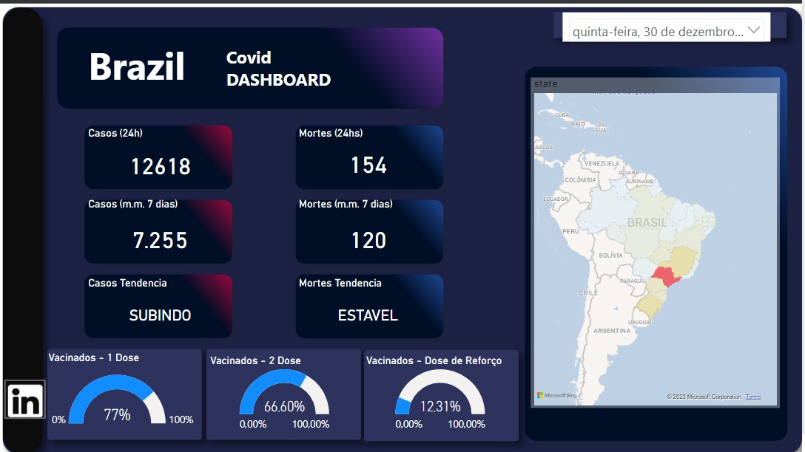
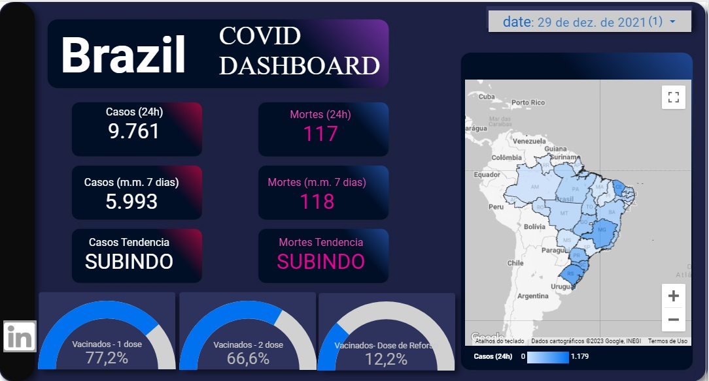

# Apresentação de Dashboard interativo usando Google Data Studio &amp; Microsoft Power BI

## Tópicos
1. Introdução;
2. Análise Exploratória de Dados;
3. Visualização Interativa de Dados;
4. Storytelling.

## 1. Introdução
A COVID-19 é uma doença causada pelo coronavírus SARS-CoV-2, altamente contagiosa e perigosa, que afeta principalmente o sistema respiratório. É uma ameaça global, e o combate à pandemia depende da disponibilidade de dados precisos sobre a evolução dos casos em diferentes regiões geográficas. Este projeto tem como objetivo criar um dashboard interativo que permita explorar e visualizar os dados de casos e vacinação do Brasil. O dashboard será desenvolvido utilizando tanto a plataforma Google Data Studio quanto o Microsoft Power BI e apresentará as principais KPIs.

Os dados sobre casos da COVID-19 são compilados pelo Centro de Ciência de Sistemas e Engenharia da Universidade Americana John Hopkins [link](https://www.jhu.edu/). Esses dados são atualizados diariamente desde janeiro de 2020, com uma granularidade temporal de dias e geográfica que inclui regiões de países (estados, condados, etc.).

Já os dados sobre vacinação da COVID-19 são compilados pelo projeto Nosso Mundo em Dados (Our World in Data ou OWID) da Universidade Britânica de Oxford [link](https://www.ox.ac.uk/). Esses dados também são atualizados diariamente desde janeiro de 2020, com uma granularidade temporal de dias e geográfica que abrange os países.

## 1.1. TLDR

Dashboard: Google Data Studio [link](https://lookerstudio.google.com/reporting/20c864df-7fb0-4d4d-9924-b86a9abb1f7d);

Dashboard: Microsoft Power BI [link](https://app.powerbi.com/view?r=eyJrIjoiNWNmYjI0ZGYtODUyNi00ZWExLWJjMTktODY3ODI1ODE1NjBmIiwidCI6ImFlYzc5NmIyLWQxMWQtNDEzMy05YTE1LWJhODBiNmI5MjJkMiJ9);

Processamento: Kaggle Notebook [link](https://www.kaggle.com/code/anibalmaldonado/covid-19-dashboard-com-google-data-studio);

Fontes: Casos pela universidade John Hopkins [link](https://www.jhu.edu/);

Vacinação pela universidade de Oxford [link](https://www.ox.ac.uk/).

# 2. Análise Exploratória de Dados
No código Python ETL_Covid19.ipynb foram importados os seguintes pacotes e bibliotecas:

- math: É um módulo embutido no Python que fornece funções matemáticas. Ele é utilizado para realizar operações matemáticas avançadas, como cálculos trigonométricos, exponenciais, logarítmicos, etc.

- typing.Iterator: É uma classe do módulo typing do Python que define um protocolo para iteração. Ela é usada para indicar que um objeto é um iterador, ou seja, é capaz de fornecer itens um por um quando iterado.

- datetime e timedelta: São classes embutidas no módulo datetime do Python. datetime é usada para trabalhar com datas e horas, permitindo a criação, manipulação e formatação de datas e horários. timedelta é usada para representar diferenças ou intervalos entre datas e horas.

- numpy (abreviação de "Numerical Python"): É uma biblioteca de computação numérica que fornece suporte para matrizes e operações matemáticas em larga escala. Ela é amplamente utilizada para cálculos científicos e numéricos eficientes, especialmente quando se lida com grandes conjuntos de dados.

- pandas: É uma biblioteca de código aberto amplamente utilizada para análise e manipulação de dados. Ela oferece estruturas de dados flexíveis e eficientes, como o DataFrame, que permite a organização e manipulação de dados tabulares. O pandas é muito utilizado em tarefas de limpeza, transformação, visualização e análise de dados.

# 3. Visualização Interativa de Dados

Covid DashBoard com Microsoft Power BI

Dashboard [link](https://app.powerbi.com/view?r=eyJrIjoiNWNmYjI0ZGYtODUyNi00ZWExLWJjMTktODY3ODI1ODE1NjBmIiwidCI6ImFlYzc5NmIyLWQxMWQtNDEzMy05YTE1LWJhODBiNmI5MjJkMiJ9)

Covid DashBoard com Google Data Studio

Dashboard [link](https://lookerstudio.google.com/reporting/20c864df-7fb0-4d4d-9924-b86a9abb1f7d)

# 4. Storytelling

Os dashboards sobre a COVID-19 foram desenvolvidos tanto o Google Data Studio quanto o Microsoft Power BI contendo diferentes KPIs, mapa do Brasil para visualização de casos e mortes por estado, gráficos que indica a quantidade de pessoas vacinadas na primeira dose, segunda dose e dose de reforço e indicadores de tendencia.

Tanto o Google Data Studio quanto o Microsoft Power BI são ferramentas populares e poderosas para a criação de painéis interativos e visualização de dados. Ambas oferecem recursos avançados para a criação de gráficos, tabelas, mapas e outras visualizações, permitindo apresentar de forma clara e impactante as informações sobre a pandemia.

Além disso, essas ferramentas também fornecem recursos de personalização, filtros interativos e opções de compartilhamento, o que possibilita que os usuários explorem os dados de maneira dinâmica e interativa. Dessa forma, é possível extrair insights relevantes e comunicar de forma eficaz as tendências, padrões e impactos da COVID-19.

É interessante destacar que tanto o Google Data Studio quanto o Microsoft Power BI possuem suas próprias vantagens e recursos exclusivos, e a escolha entre as duas pode depender das necessidades específicas do projeto, preferências pessoais e recursos disponíveis. Utilizado ambas as ferramentas ressalta a qualidade e versatilidade de ambas no contexto de criação de dashboards e elas podem ser extremamente úteis para transmitir informações importantes e contribuir para a compreensão da situação da COVID-19.
